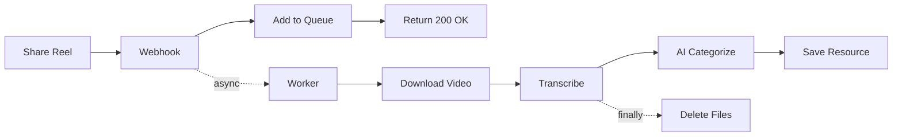

# Instagram Transcription with BullMQ - Setup Complete! ✅

## What's New:

### 1. **Fixed Transcription** - Romanized Output Only
- ✅ All transcripts in English/Roman script
- ✅ Hindi → "namaste" (not "नमस्ते")  
- ✅ Better AI analysis
- ✅ Improved text parsing

### 2. **BullMQ Worker Queue** - Background Processing
- ✅ Webhook responds instantly (< 1 second)
- ✅ Jobs process in background
- ✅ Automatic retries on failure
- ✅ Process 2 jobs simultaneously

### 3. **Guaranteed File Cleanup** - No Temp File Leaks
- ✅ `try-finally` blocks
- ✅ Files deleted even on errors
- ✅ Logs cleanup actions

## How It Works Now:



## Architecture:

**Before (Synchronous):**
- Webhook → Process → Transcribe → Save
- Took 15-30 seconds
- Meta might retry if timeout

**After (Async with BullMQ):**
- Webhook → Add Job → Return (< 1s)
- Worker → Process in background
- Scales to many reels

## Files Created:

1. **`transcriptionQueue.ts`** - Queue configuration with Redis
2. **`transcriptionWorker.ts`** - Background worker that processes jobs
3. **Updated `instagram-webhook.ts`** - Now uses queue

## Features:

### Queue Management
- **Retries**: 3 attempts with exponential backoff
- **Concurrency**: Processes 2 jobs at once
- **Rate Limit**: Max 10 jobs/minute
- **Persistence**: Jobs saved in Redis
- **History**: Keeps last 100 completed, 50 failed

### File Cleanup
```typescript
try {
  // Download, transcribe, save
} finally {
  // ALWAYS delete files
  await cleanup(videoPath, audioPath);
}
```

### Transcription
- **Command**: `whisper-cli -l auto -tr` (romanized output)
- **Parsing**: Filters out system messages
- **Logging**: Shows language detected and transcript preview

## Usage:

**1. Ensure Redis is Running:**
```bash
redis-cli ping
# Should return: PONG
```

**2. Restart Backend:**
```bash
npm run start
```

You'll see:
```
👷 Transcription worker started
```

**3. Share a Reel:**

**Webhook logs (instant):**
```
📱 Webhook request received
🎬 Found Instagram reel
✅ Job 1 added to queue
```

**Worker logs (background):**
```
🎬 Processing transcription job: 1
   Reel: Duniya gol nahi hai...
🎙️  Starting transcription...
📥 Downloading video...
🎵 Extracting audio...
🎙️  Transcribing audio...
✅ Transcription complete
   Language: hindi
   Text (romanized): duniya gol nahi hai duniya madar...
🗑️  Deleted: video_1763902075.mp4
🗑️  Deleted: audio_1763902075.wav
✅ Resource created successfully: clxxxxxx
✅ Job 1 completed successfully
```

## Benefits:

✅ **Fast Webhooks** - Meta never times out
✅ **Background Processing** - Doesn't block server
✅ **Automatic Retries** - Failed jobs retry automatically
✅ **Scalable** - Can handle many reels simultaneously
✅ **Clean** - No temp file leaks
✅ **Romanized** - All transcripts searchable in English
✅ **Reliable** - Redis persists jobs across restarts

## Testing:

1. Share an Instagram reel
2. Check instant webhook response
3. Watch worker process it in background
4. Verify files are cleaned up
5. Search for transcript content!

## Troubleshooting:

**"Cannot connect to Redis":**
```bash
sudo systemctl start redis
# or
redis-server --daemonize yes
```

**No worker logs:**
- Check `index.ts` imports worker
- Restart backend

**Jobs stuck:**
```bash
# Clear queue
redis-cli FLUSHALL
```

**Files not deleting:**
- Check logs for `🗑️ Deleted` messages
- Worker now uses `try-finally` - should always delete

## What's Next:

Ready to test! Share a Hindi/Hinglish reel and watch it:
1. Get transcribed in Roman script
2. Process in background
3. Clean up files automatically
4. Become searchable by spoken words!

🎉
