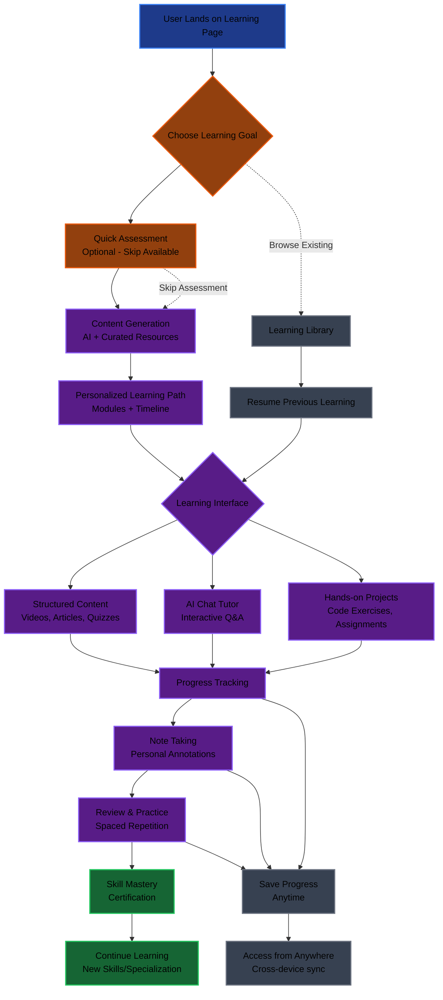
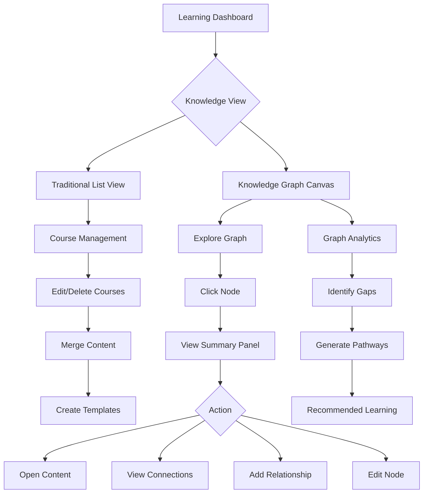

# Learning Page Flow Diagram



## Key Flow Principles

### 1. Single Entry Point
- One clear "Start Learning" button
- No mode switching confusion
- Unified experience for all learning activities

### 2. Flexible Assessment
- Optional quick assessment (3-5 questions)
- Skip option for experienced learners
- Results inform personalization without being mandatory

### 3. Multi-Modal Learning
- **Structured Content**: Videos, articles, step-by-step guides
- **Interactive Chat**: AI tutor for questions and clarification
- **Hands-on Practice**: Code editors, projects, exercises

### 4. Active Learning Features
- **Note Taking**: Personal annotations and summaries
- **Review System**: Spaced repetition and active recall
- **Progress Tracking**: Visual progress bars and achievements

### 5. Learning Library
- All learning materials in one place
- Resume previous learning sessions
- Cross-device synchronization

### 6. Continuous Learning
- Skill mastery certification
- Recommendations for advanced topics
- Building learning streaks and habits

## User Journey Examples

### New Learner
1. "I want to learn Python" → Quick assessment → Personalized curriculum → Start learning

### Experienced Learner
1. Skip assessment → Browse topics → Jump into advanced modules → Add personal notes

### Returning Learner
1. Open Learning Library → Resume where left off → Continue with AI chat support

## Technical Implementation

### Frontend Components
- `LearningDashboard`: Main entry point
- `SkillSelector`: Topic selection with suggestions
- `QuickAssessment`: Optional skill check
- `CurriculumBuilder`: AI + curated content generation
- `LearningPlayer`: Multi-modal learning interface
- `ProgressTracker`: Visual progress and analytics
- `NoteEditor`: Rich text note taking
- `ReviewSystem`: Spaced repetition interface

### Backend Integration
- Assessment API for skill evaluation
- Content generation with AI + curated resources
- Progress persistence and analytics
- Note storage and synchronization
- Review scheduling algorithms

### Data Flow
```
User Input → Assessment → Content Generation → Learning Session → Progress Update → Note Storage → Review Scheduling
```

This flow eliminates the current complexity while adding powerful learning features that users actually need.

---

# Enhanced Knowledge Graph System

## Overview

Building on the improved learning flow, we add a comprehensive knowledge graph system that automatically connects all learning materials, enables visual exploration, and creates a true "second brain" experience.

## Key Features

### 1. Unified Knowledge Hub
- **Automatic Connections**: All learning materials (courses, modules, notes, resources) are automatically linked based on semantic similarity using existing embeddings
- **Cross-Reference System**: Related concepts from different courses/modules are connected
- **Dynamic Linking**: New content automatically finds and connects to related existing knowledge

### 2. Visual Knowledge Graph Canvas
- **Interactive Graph View**: Canvas-based visualization of all knowledge with nodes and connections
- **Node Types**: Different visual representations for subjects, modules, notes, resources, weak points
- **Relationship Lines**: Weighted connections showing strength of relationships
- **Zoom & Navigation**: Pan, zoom, and search within the knowledge graph

### 3. Enhanced Course Management
- **Edit/Delete Capabilities**: Full CRUD operations on generated courses and modules
- **Merge Related Content**: Combine similar modules from different courses
- **Version Control**: Track changes to learning materials over time
- **Template System**: Save successful course structures as reusable templates

### 4. Smart Knowledge Discovery
- **Graph-Based Recommendations**: Suggest next learning topics based on graph connections
- **Gap Analysis**: Identify missing connections in knowledge graph
- **Learning Pathways**: Generate optimal learning sequences through the graph

## Technical Implementation

### Database Extensions
```sql
-- Knowledge Graph Relationships Table
model KnowledgeConnection {
  id          String @id @default(uuid())
  user_id     String
  source_id   String  // ID of source node
  source_type String  // "subject", "module", "resource", "note"
  target_id   String  // ID of target node
  target_type String  // "subject", "module", "resource", "note"
  strength    Float   // 0-1 similarity score
  type        String  // "semantic", "prerequisite", "related", "user_defined"
  created_at  DateTime @default(now())

  @@unique([user_id, source_id, source_type, target_id, target_type])
}
```

### Graph Generation Algorithm
1. **Embedding-Based Similarity**: Use cosine similarity on existing embeddings
2. **Threshold Filtering**: Only create connections above similarity threshold (0.7+)
3. **Relationship Classification**: Categorize connections by type and strength
4. **Graph Optimization**: Remove redundant connections and optimize layout

### Canvas Implementation
- **React Flow**: Interactive node-based canvas
- **D3.js Integration**: Advanced graph algorithms and layouts
- **Real-time Updates**: Graph updates as new content is added
- **Search & Filter**: Find specific nodes and highlight connections

## User Experience Flow



## Integration Points

### With Existing Learning Flow
- **Assessment Results**: Feed into graph as weak point nodes
- **Progress Tracking**: Update node status and connection strengths
- **Note Taking**: New notes automatically connect to related content
- **Review System**: Spaced repetition based on graph centrality

### With Current Backend
- **Embeddings**: Leverage existing embedding system for similarity calculations
- **Search**: Graph-based search with relationship context
- **AI Generation**: Use AI to suggest new connections and identify gaps

## Benefits

### For Learners
- **Holistic View**: See how all knowledge connects together
- **Discovery**: Find related concepts they didn't know existed
- **Personalization**: Learning paths adapt based on their knowledge graph
- **Retention**: Visual connections improve memory and understanding

### For the System
- **Unified Experience**: Single place to manage all learning content
- **Better Recommendations**: AI can suggest truly relevant next steps
- **Scalability**: Graph structure handles unlimited content growth
- **Analytics**: Rich insights into learning patterns and knowledge gaps

## Implementation Roadmap

### Phase 1: Foundation
- Add KnowledgeConnection table
- Implement basic similarity calculations
- Create graph data structure

### Phase 2: Canvas UI
- Build React Flow canvas component
- Implement node types and interactions
- Add search and filtering

### Phase 3: Smart Features
- Automatic connection generation
- Graph-based recommendations
- Enhanced course editing

### Phase 4: Advanced Analytics
- Learning pathway optimization
- Knowledge gap analysis
- Predictive learning suggestions

This enhanced system transforms the learning platform from a collection of separate courses into a truly integrated knowledge management system - the user's second brain.